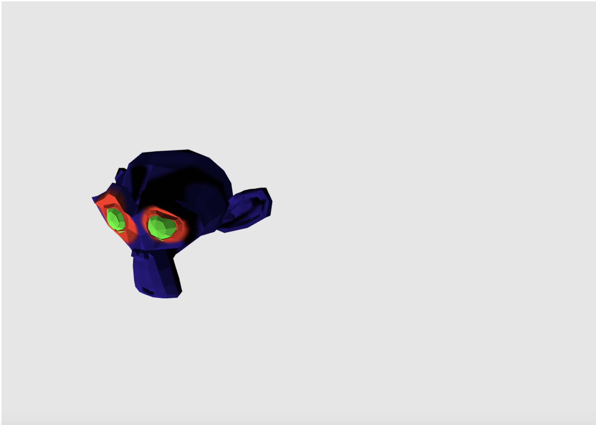

# Computer Graphics - Blender

In this lab, you will learn to create and texture models in Blender, export the models to obj files, and display them in your WebGL project.

To complete this lab, you should follow these steps:

1. Run the lab as is. You should see a (badly painted) monkey head (Suzy) rotating in the left side of the canvas: 
2. Follow through the demonstration in class to create and unwrap a cube in Blender in order to texture it with the provided [texture](./lab/textures/cube-texture.jpg). We will then export the cube in obj format and display it in our WebGL project.
3. Follow the demonstration in class to create, unwrap and begin painting Suzy.
4. Complete your paint job, and replace the provided Suzy with your own.
5. Create at least 2 more textured models and display them in the same demo.
	* Each model should be unique and should have a unique texture.
	* You may find [this tutorial series](https://www.youtube.com/watch?v=yi87Dap_WOc&t=14s) helpful. It goes through modelling good practices (and some useful tricks and tips) and then goes through UV mapping and texturing.
	* Models may be hand-painted or may use a pre-existing texture.
	* Note that the only data that we'll be extracting positions, normals, texture coordinates and the index from the model; if you find guides that add fancy visual effects beyond this data, these guides likely rely on Blender functionality that we have not implemented and the results will not carry into your WebGL project.
	* Normal mapping is supported in the initial project (see [bumpuvmesh.js](./lab/mesh/bumpuvmesh.js)), so if you find textures with matching normal maps you can use them to texture your models.
6. Zip and submit your completed project.
